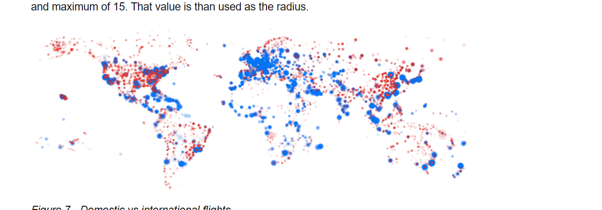

## Summary
This code visualizes the tree census data in New York City from 2015 using circles with different colors representing the health condition of the trees. By relying on the specific latitude and longitude ranges provided in the mapping functions, the code uses geographical coordinates to map tree locations.

## Data
I used the datasets "2015 Tree Census in NYC" provided on our course website which is conducted by volunteers and staff organized by NYC Parks & Recreation and partner organizations. Tree data collected includes tree species, diameter and perception of health.

I chose this dataset because nowadays environmental issues have become a big concern, and this dataset directly reflects the environment of the city we live in (NYC), which attracts me to discover more. It also reminded me of the Black Census in the book I read this week, and there are similarities between the two. After reading the book, I thought I might try my own way of doing a data visualization.

I used these fields below:
1. health: Indicates the collector's perception of tree health
2. latitude: Latitude of data point, in decimal degrees
3. longitude: Longitude of data point, in decimal degrees

I used a total of 65,214 data points. The loop in this code iterates from 0 to 65,213, which accounts for all the data points in the dataset.

I visualized the health condition of the tree and mapped them onto the canvas based on the latitude and longitude information which finally showed as a shape of NYC map.

## Process
1. I first preloaded a JSON datasets.
2. I used the setup() function to initialize the canvas: set the drawing mode to center, define colors representing different levels of tree health(Good:green, Fair: Yellow, Poor: Red), prevent the draw() function from continuously looping.
3. I started to draw a background and display a title and subtitle for the visualization.
4. Then I set the transparency of three colors for "Good," "Fair," and "Poor" health levels to make sure the circles are not obscured.
5. I iterated through the tree data: determine the tree's latitude and longitude, map the latitude and longitude onto the canvas, set the color of the circle representing the tree based on its health condition, draw the circle and legend.

## Reference
Here are the images that inspired me.

## Hard & Fun
I first wanted to visualize the data based on a NYC map, but I found I can't determine the latitude and longitude of the image. It didn't fit with the data. So I decided not to use it. 

Then I found I need enough datapoints to create the shape of NYC, so I used more than 1000 datapoints, by changing the transparency, the circles are not so overlapping with each other.
